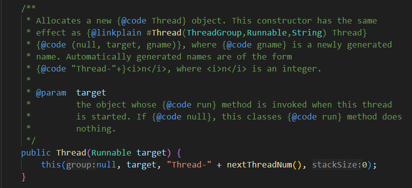
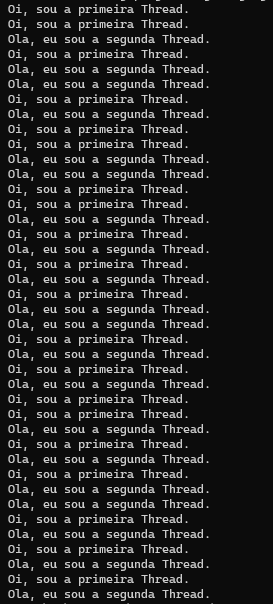

# Threads em Java

Uma thread é a menor unidade de uma determiada tarefa.

Em uma tarefa podem existir multiplas threads, que podem ser executadas paralelamente enquanto dividem recursos.

Em um programa/aplicação os comandos são executados em sequência (normalmente), porém podemos tentar os executar simultaneamente com multiplas threads, em Java isso não é possível com objetos normais, você precisa transforma-los em threads.

# Criando Threads com a Classe Thread

Se você deseja criar objetos como threads, basta extender a Thread à classe do objeto criado. No momento em que você herda a classe Thread, sua subclasse não será mais uma classe ordinária, ela será uma Thread. Em toda thread deve existir um método run(), que será executado toda vez que a instância da subclasse chamar o método start().

O no sistema operacional existe o conceito de schedular, que é responsável por organizar quais threads existentes serão executadas e quando. Com o método setPriority() podemos determinar a prioridade de uma determinada instância de Thread, sugerindo ao schedular do sistema operacional qual thread ele deve ou não priorizar.

O método setPriority() recebe valores inteiros de 1 a 10, sendo 10 o representante do nível mais alto de prioridade. Por padrão todas as threads terão prioridade normal, ou seja, 5. A classe Thread possui 3 constantes que podem ser utilizadas no setPriority(): MIN_PRIORITY, NORM_PRIORITY, MAX_PRIORITY.

O método sleep() também pode ser utilizado para interromper a execução de uma determinada thread por determinado tempo.

**Código:**

```
class A extends Thread {

    public void run() {
        for(int i=0; i<20; i++) {
            System.out.println("Oi, sou a classe A.");
            
            try { Thread.sleep(10); }
            catch(InterruptedException e) {}
        }
    }
}

class B extends Thread {

    public void run() {
        for(int i=0; i<20; i++) {
            System.out.println("Ola, sou B.");

            try { Thread.sleep(10); }
            catch(InterruptedException e) {}
        }
    }
}

public class ThreadsEmJava {
    
    public static void main(String[] args) {

        A instanciaA = new A();
        B instanciaB = new B();

        instanciaA.setPriority(Thread.MIN_PRIORITY + 9);
        instanciaB.setPriority(10);

        instanciaA.start();

        try { Thread.sleep(10); }
        catch(InterruptedException e) {}
        
        instanciaB.start();
    }
}
```

**Saída de execução:**


# Criando Threads com a Interface Runnable

Precisar extender a classe Thread para poder criar threads pode não ser possível caso sua classe precise extender outra classe Java, tendo em vista que não existe herança multipla em Java.

Se olharmos a documentação da classe Thread, iremos perceber que ela implementa a interface Runnable:


Além disso, a classe Thread possui diversos contrutores. Em um deles, um objeto do tipo Runnable é passado como parâmetro.



Sendo assim, podemos utilizar esses recursos para criarmos threads sem precisar herdar a classe Thread, mas sim implementar a classe Runnable nas classes a partir das quais iremos criar nossas threads.

Uma vez implementada a interface Runnable, sobrescrevos o método run(), instanciamos nossa classe definindo o tipo do objeto como Runnable, criamos uma instância da classe Thread passando como argumentos a instância que acabamos de criar, e chamamos o método start() na instancia da classe Thread.

Veja o exemplo: 

**Código:**

```
class A implements Runnable {

    public void run() {
        for(int i=0; i<20; i++) {
            System.out.println("Oi, sou a classe A.");
            
            try { Thread.sleep(10); }
            catch(InterruptedException e) {}
        }
    }
}

class B implements Runnable {

    public void run() {
        for(int i=0; i<20; i++) {
            System.out.println("Ola, sou B.");

            try { Thread.sleep(10); }
            catch(InterruptedException e) {}
        }
    }
}

public class ThreadsERunnableInterface {
    
    public static void main(String[] args) {

        Runnable instanciaA = new A();
        Runnable instanciaB = new B();

        Thread threadA = new Thread(instanciaA);
        Thread threadB = new Thread(instanciaB);

        threadA.start();

        try { Thread.sleep(10); }
        catch(InterruptedException e) {}
        
        threadB.start();
    }
}
```

**Saída de execução:**


# Threads, Runnable Interface & Lambda Functions

Se olharmos a documentação da interface Runnable iremos perceber que ela é uma interface funcional, ou seja, possui um único método abstrato, que é o método run().

Logo podemos usar uma função lambda para implementarmos o método run() no momento de instanciamento da instâncias da classe Thread, observe como podemos fazer isso:

**Código:**

```
public class ThreadsELambdaFunctions {
    
    public static void main(String[] args) {

        Runnable obj1 = () -> 
        {
            for(int i=0; i<20; i++) {
                System.out.println("Oi, sou a primeira Thread.");

                try { Thread.sleep(10); }
                catch(InterruptedException e) {}
            }
        };

        Runnable obj2 = () -> 
        {
            for(int i=0; i<20; i++) {
                System.out.println("Ola, eu sou a segunda Thread.");

                try { Thread.sleep(10); }
                catch(InterruptedException e) {}
            }
        };

        Thread threadA = new Thread(obj1);
        Thread threadB = new Thread(obj2);

        threadA.start();

        try { Thread.sleep(10); }
        catch(InterruptedException e) {}
        
        threadB.start();
    }
}
```

**Saída de execução:**

